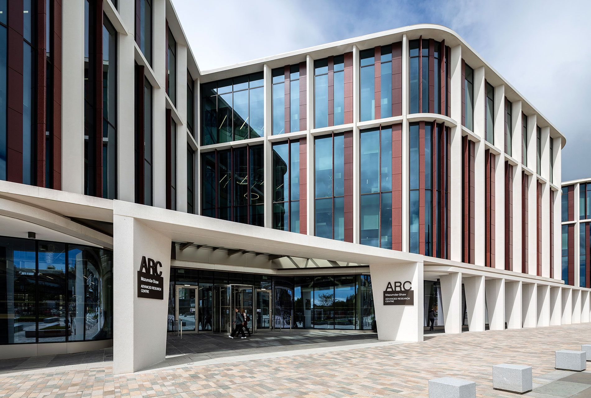

# UK-UHF-pTx-Workshop-2024

Building upon the momentum of the German Ultrahigh Field Imaging (GUFI) Network’s pTx Workshop hosted in Tübingen in 2023, this workshop will once again bring together experts on the topic of parallel transmission (pTx) to discuss latest advances in our field.

This workshop is being organized by a group of pTx users from the Universities of Glasgow (Dr Sydney Williams, Prof David Porter, Dr Kristin Flegal), Oxford (Dr Aaron Hess), and Cambridge (Prof Christopher Rodgers), on behalf of the UK 7T Network. It will be hosted at the [University of Glasgow Advanced Research Centre (ARC)](https://www.gla.ac.uk/research/arc/){:target="_blank"} on June 10-11, 2024. Registration will also be open to pTx researchers outside of the UK until workshop capacity (~100) is reached. 

The workshop schedule is currently being finalized, but will contain a mix of invited speaker, group discussions, and proferred talks from attendees. Three main themed sessions will take place on the second day:
1. pTx safety
2. RF pulse design and pTx sequences
3. 7T user needs for pTx

Please register for the workshop and find further information at the links below.

## Registration

Registration for the workshop is free and includes catered coffee breaks and lunch. There is an optional social event on the evening of June 10th that is being offered at a subsized cost for £25 and includes a three-course meal with a drink and a live-band Ceilidh (pronounced "kay-lee", traditional Scottish social gathering). Workshop and social event registration are both found through the following link:

_Registration will close the night of Monday, May 20th to provide accurate numbers to event services for catering. Please endeavor to register as soon as possible before capacity is reached_

## Additional Event Info
- [Schedule](schedule.md)
- [Travel & Accommodation](travel.md)

## Sponsors

We are humbled by the generous support from our sponsors, without whom this event would not be possible:
- [Siemens Healthcare UK](https://www.siemens-healthineers.com/en-uk){:target="_blank"}
- [MR CoilTech, Ltd](https://www.mr-coiltech.co.uk/){:target="_blank"}
- [The University of Glasgow Centre for Excellence in Trials Collaboration (CETC)](https://www.gla.ac.uk/colleges/mvls/researchinnovationengagementsupport/cetc/){:target="_blank"}

We would also like to extend our many thanks to [Dario Bosch](https://github.com/dabosch){:target="_blank"} and the rest of the group at MPI Tübingen for beginning this workshop idea and for the nice Github pages inspiration!

## Further Guidance

If you have any additional questions, wish to offer suggestions, or have any special accommodation requirements, please contact [Sydney Williams](mailto:sydney.williams@glasgow.ac.uk).

